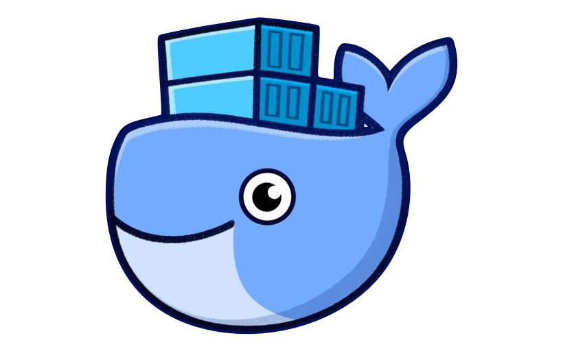
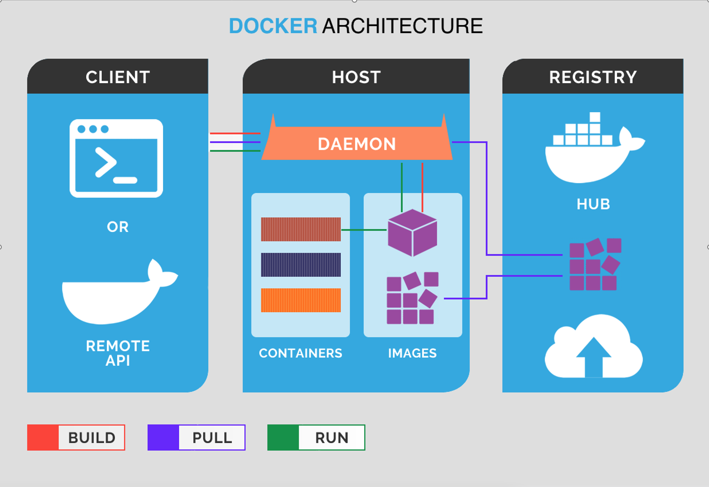
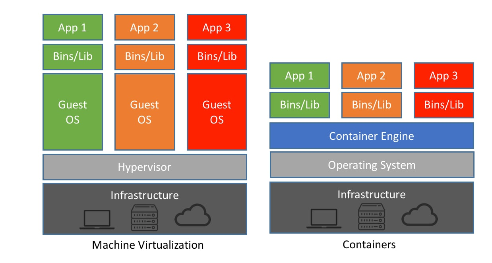

## Docker for pocker!

 
 ---
 ## 
 

<!--
Så hva er en container?​
​
En container inneholder et helt runtime environment:​
- binærfiler​
- konfigurasjon​
- dependencies​
- Libraries​
Når du bundler alt dette sammen så får du et containerimaget.​
​
Så når du skal fyre opp en container i docker så må du først bygge eller pulle et container image fra et image registry​
Et Image registry kan være hostet på en server, on prem eller I skya​
Default så henter docker dette fra dockerhub.com​
-->
---
## 

<!--
En container deler kernel med host operativsystemet, men i read only.​
Flere containere kan kjøres på samme host, Men de er fortsatt isolert fra hverandre.​
​
Continere er "stateless", det vil si at hver gang du stopper og starter en container så​
vil den ikke ha lagret endringer som har skjedd underveis. Men du kan tildele ​
mounts eller volumes sånn at containeren har mulighet til og skrive til presitant storage.​
​
Fordi containere deler host operativsystemet, bruker hver container betydlig mindre ressurser ​
en feks pr VM​
​
En av de største fordelene med containere er at man får samme resulat på forskjellige systemer.​
Feks, kan du utvikle en container på laptopen din og flytte den til en server on-prem eller i skya..​
-->

---
##

